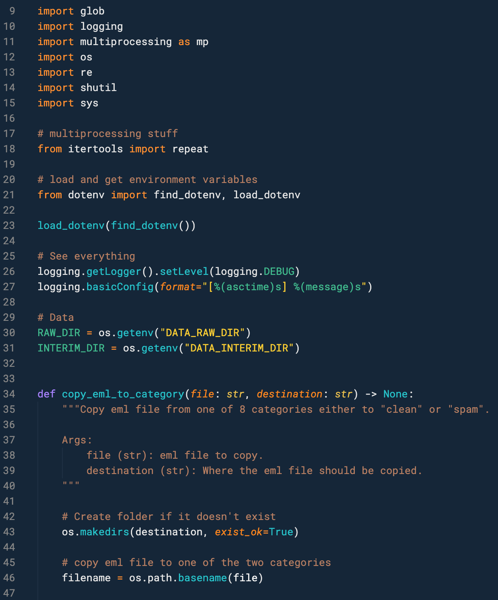

# Hivacruz Theme for VSCode

A dark blue theme for Visual Studio Code, available on the [Extensions Marketplace](https://marketplace.visualstudio.com/items?itemName=kinoute.hivacruz-theme).


## Status

The theme is a _work in progress_ and might change a lot in the upcoming weeks.

## Installation

1. Open the **Extensions** sidebar in VS Code with `View → Extensions`
2. Search for `Hivacruz`, choose "Hivacruz Theme" by **Yann Defretin**
3. Click **Install** to install it
4. Click **Reload** to reload your editor
5. Navigate to `File → Preferences → Color Theme → Hivacruz`
6. Yay! You're all set 🎉🎉.

## Preferences shown in the preview

Here are the settings used in the preview screenshot posted above:

### Font

The font used and **recommended** for this theme is [Roboto Mono](https://fonts.google.com/specimen/Roboto+Mono) by Christian Robertson. We recommend to use the "[Powerline](https://github.com/powerline/fonts/tree/master/RobotoMono)" version to have a better experience while using the integrated Terminal – in case you're using `zsh` for example. But the simple "Roboto Mono" font is fine too, just don't forget to change your settings according to the version you use.

On macOS, you can install the fonts with Homebrew like this:

```bash
brew tap homebrew/cask-fonts
brew cask install font-roboto-mono # basic roboto mono version
brew cask install font-roboto-mono-for-powerline # better roboto mono for terminal
```

### VSCode Settings

At the moment, I use these settings:

```json
{
  "editor.formatOnSave": true,
  "window.nativeTabs": false,
  "window.zoomLevel": 0,
  "editor.fontFamily": "Roboto Mono for Powerline",
  "terminal.integrated.fontFamily": "Roboto Mono for Powerline",
  "window.titleBarStyle": "custom",
  "workbench.iconTheme": "vscode-great-icons",
  "workbench.colorTheme": "Hivacruz",
  "editor.renderLineHighlight": "all"
}
```

### File Icons Theme

As seen in the `json` file above, I use the simple [VSCode Great Icons](https://marketplace.visualstudio.com/items?itemName=emmanuelbeziat.vscode-great-icons) theme for the sidebar icons. But any File Icons Theme should do the job and fit with the theme.

## Syntax Highlighting

Here are some examples of the color scheme for different languages:

### Preferences Panel


### PHP


### Ruby


### Python



### CSS


### JS


### HTML


### Markdown


### Dockerfile


### Yaml


## Contribution

Since I have only macOS at my disposal right now to test, the theme might look weird on Windows/Linux and still need improvements.

For that matter, Issues and Pull Requests are very welcome!

## Same theme in other apps

I made similar themes with the same colours for different applications. Here there are:

- Sublime Text theme: https://github.com/kinoute/hivacruz-sublime-theme
- Typora Theme: https://github.com/kinoute/typora-hivacruz-theme
- iTerm2: https://github.com/kinoute/hivacruz-itermcolors
- Nova: https://github.com/kinoute/hivacruz-nova-theme

## Credits

- Created by [Yann Defretin](https://github.com/kinoute).
