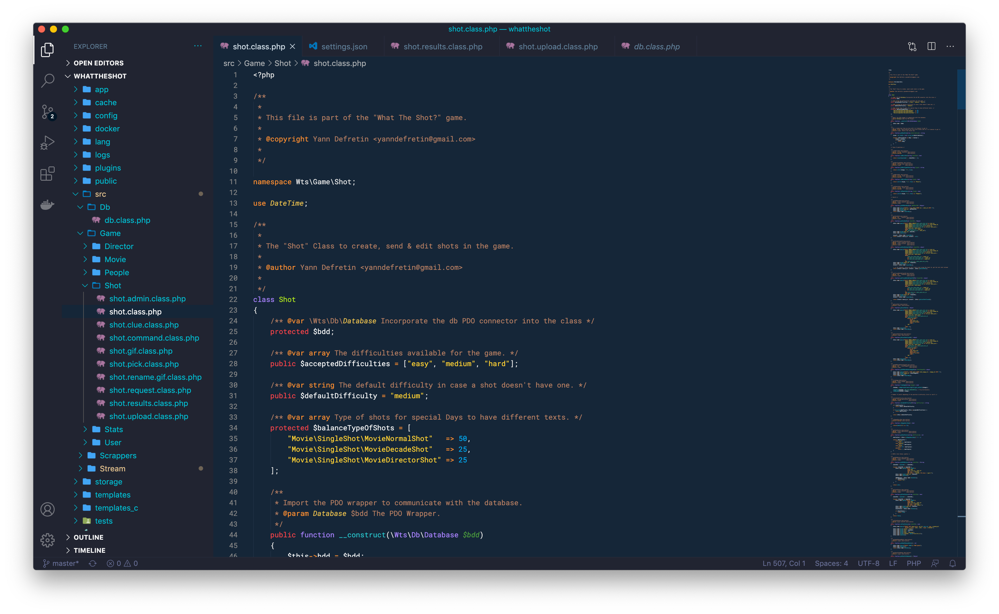

# Hivacruz Theme for VSCode

A dark blue theme for Visual Studio Code.



## Status

The theme is a *work in progress*. It can be used but it's not available yet on the Extension Marketplace.

## Best settings

The font used in the screenshots is [Roboto Mono](https://fonts.google.com/specimen/Roboto+Mono) by Christian Robertson. On macOS, you can install it with Homebrew like this:

```bash
brew tap homebrew/cask-fonts
brew cask install font-roboto-mono
```

## Same theme in other apps

I made similar themes with the same colours for different applications. Here there are:

* Sublime Text theme : https://github.com/kinoute/hivacruz-sublime-theme
* Typora Theme : https://github.com/kinoute/typora-hivacruz-theme
* iTerm2 : https://github.com/kinoute/hivacruz-itermcolors

## Credits

* Created by [Yann Defretin](https://github.com/kinoute).

